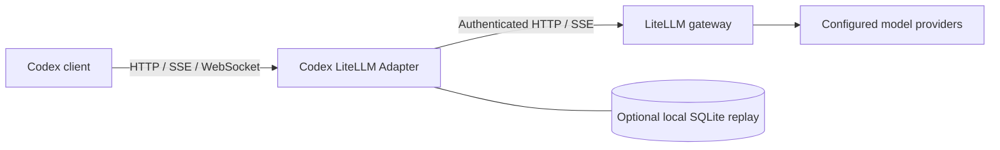

# Codex LiteLLM Adapter

[](https://github.com/nekopara-ai/codex-litellm-adapter/actions/workflows/ci.yml)
[](pyproject.toml)
[](LICENSE)

Connect Codex clients to a LiteLLM gateway with model discovery, tool namespace compatibility, and stateless Responses continuation replay.

[简体中文](README.zh-CN.md) · [Configuration](docs/configuration.md) · [Architecture](docs/architecture.md) · [Contributing](CONTRIBUTING.md)

Codex and an OpenAI-compatible gateway can disagree about more than an endpoint URL: model catalogs, namespaced tools, custom tool IDs, streaming events, and conversation storage all have distinct contracts. This adapter handles those boundaries in one small Python service.



**Status:** initial alpha release. The automated suite exercises local protocol fixtures and fault recovery. Model capabilities and provider-specific compatibility still depend on your gateway configuration. This is a community project maintained by NekoPara AI, independent of OpenAI and LiteLLM.

## What it does

- **Model discovery:** translates authenticated gateway metadata into the Codex model catalog, with optional templates and ETag support.
- **Tool compatibility:** flattens namespaces where configured, restores function and custom tool calls, and preserves `call_id` when incompatible optional item IDs are removed.
- **HTTP, SSE, and WebSocket:** bridges Responses WebSocket requests to HTTP streaming upstreams. Shared event decoding handles multiline SSE; Chat Completions keeps its own `[DONE]` termination semantics.
- **Stateless continuation:** reconstructs `store=false` histories for `previous_response_id`, scoped by caller credentials and model. Supports bounded memory or SQLite storage.
- **Recovery:** bounds pending replay writes, retries failed persistence, expires retained failures, and preserves authoritative completed outputs.
- **Operational behavior:** uses a separate health connection pool, preserves encoded paths, rewrites same-upstream redirects, and returns structured errors for truncated JSON responses.

Authentication, model routing, billing, and rate limits remain the responsibility of the upstream gateway. The adapter does not create users, distribute keys, or change models.

## Quick start

You need Python 3.11+ and an existing LiteLLM gateway with an authenticated `/v1/models` endpoint and a working `/v1/responses` route for your chosen model.

```bash
git clone https://github.com/nekopara-ai/codex-litellm-adapter.git
cd codex-litellm-adapter
python3 -m venv .venv
. .venv/bin/activate
python -m pip install .

export CODEX_ADAPTER_UPSTREAM=http://127.0.0.1:4000
export CODEX_ADAPTER_REPLAY_DB="$PWD/state/replay.sqlite3"
codex-litellm-adapter
```

The default listener is `127.0.0.1:4001`. Omitting `CODEX_ADAPTER_REPLAY_DB` uses bounded in-memory replay, which does not survive a restart. Environment variables are read at startup; the process does not automatically load `.env` files.

```bash
curl --fail http://127.0.0.1:4001/health
```

### Connect Codex

Merge this into your Codex configuration, replacing `your-gateway-model` with a model served by your gateway:

```toml
model = "your-gateway-model"
model_provider = "litellm_adapter"

[model_providers.litellm_adapter]
name = "LiteLLM Adapter"
base_url = "http://127.0.0.1:4001/v1"
wire_api = "responses"
env_key = "LITELLM_API_KEY"
```

Set `LITELLM_API_KEY` in the environment that launches the client, using your own gateway key. The client sends this key through the adapter to LiteLLM; no shared upstream master key is bundled or required. See the official [custom provider configuration](https://developers.openai.com/codex/config-advanced/) and [configuration reference](https://developers.openai.com/codex/config-reference/).

### Docker Compose

```bash
cp .env.example .env
# Set CODEX_ADAPTER_UPSTREAM to a gateway reachable from the container.
docker compose up --build -d
```

The example publishes port 4001 on host loopback, runs as a non-root user, and stores replay state in a named volume. It builds from this repository; no published image or PyPI package is assumed.

## Compatibility is explicit

Native `gpt-*` namespaces pass through by default. Other model names use function namespace flattening. For a backend that needs the custom-tool bridge, opt in by its actual public model name:

```bash
export CODEX_ADAPTER_NS_FORCE_FLATTEN='^your-gateway-model$'
```

The custom-tool bridge preserves custom tool definitions while converting namespaced historical custom calls and outputs into paired function history. Backends that accept only function tools need separate compatibility testing. No private model aliases, provider credentials, or site-specific routing rules ship in this repository.

Context-budget retry and reasoning aliases are disabled until configured. See [configuration](docs/configuration.md) before enabling them. Templates describe capabilities; they cannot add image support or increase a model's real context window.

## Develop and test

```bash
python -m pip install -e '.[dev]'
python -m pytest -q
python -m ruff check .
python -m ruff format --check .
python scripts/check_public_tree.py
python -m build
```

Tests use synthetic credentials, temporary stores, and a local fake upstream. They do not call a paid model or require production access. CI runs the suite across Python 3.11–3.14, checks formatting and public-tree hygiene, builds distribution archives, and builds the Docker image.

## Data handling

Request bodies are not logged by the adapter's own access logger. Replay storage contains conversation content and is **compressed, not encrypted**. Keep it outside Git and protect the storage volume. Upstream error messages are forwarded and may contain provider-specific details. See [SECURITY.md](SECURITY.md) for deployment and reporting guidance.

## License

[MIT](LICENSE) © NekoPara AI. Third-party dependencies retain their own licenses.
